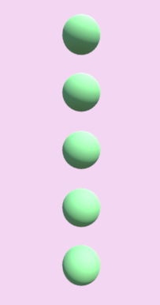

# Unity-Array-Modifier
An array modifier for Unity Engine based on the array modifier in Blender.

Like in Blender, the ArrayModifier component can be stacked to create two-dimensional or three-dimensional constructs.

 | 

Feel free to use it for anything.
Cheers!
