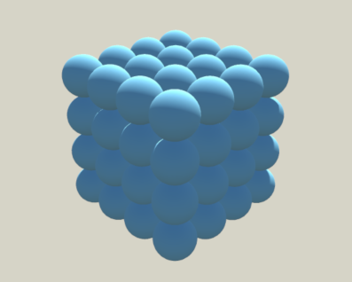

# Unity-Array-Modifier
A simple array modifier for Unity Engine based on the array modifier in Blender.

Like in Blender, the ArrayModifier component can be stacked to create two-dimensional and three-dimensional constructs.

Feel free to use it for anything.
Cheers!
